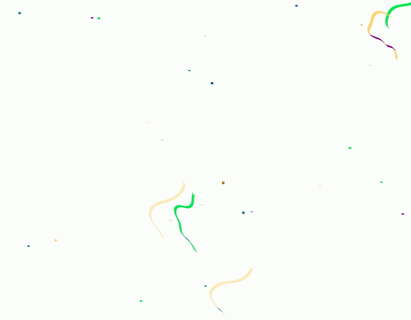

# How to Make an Animated SVG from Scratch

Run HTML file

## JPG

## MP4
https://github.com/krycreative07/Confetti-Animation/blob/main/public/20211126_confetti.mp4

## Convert
https://ezgif.com/video-to-gif/

## GIF

# Reference
https://medium.com/re-write/how-to-make-an-animated-svg-from-scratch-zero-coding-required-ca46c18d2be2
